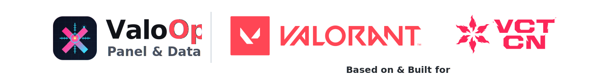

<p align="center">
  
</p>

<p align="center">
  <strong>ValoOps - VCT CN 赛区击杀事件数据集与交互式战术分析看板</strong>
</p>

<p align="center">
  
  
  
  
  
  
</p>

<p align="center">
  <a href="https://valoops.pages.dev/">
    
  </a>
</p>

---

## 📋 项目摘要

本项目包含两个核心组成部分：**面向 VCT CN 赛区的结构化击杀事件数据集**，以及**基于该数据集构建的交互式数据看板**。

**数据集** 通过计算机视觉技术对赛事 VOD 进行自动化解析，系统性地提取每局比赛中的击杀事件信息，涵盖击杀位置坐标、击杀者与死亡者信息、武器类型、技能击杀标注等结构化字段，覆盖 VCT CN 赛区历史赛事记录。

**数据看板** 提供两类核心可视化分析：

| 可视化类型 | 说明 |
|:---:|---|
| 🗺️ **击杀热力图** | 将击杀事件映射至游戏地图，直观呈现各区域的战场活跃度与交战密度 |
| 📊 **节奏图** | 以时间轴为维度还原每轮攻守博弈的动态演进，揭示双方在人数与进攻战术选择上的节奏变化 |

支持按赛事、队伍、攻防方、包点、时间范围等多维度进行筛选与对比，适用于战术研究及赛事数据挖掘等场景。

<p align="center">
  
  <br/><sub>▲ 多维度筛选、多种显示方式</sub>
</p>

**面向受众：** 职业战队与教练组、数据分析师与研究者，以及一切对电竞战术分析感兴趣的爱好者。

---

## 💡 为什么创建这个项目

电子竞技的本质是信息差的博弈，我始终相信，比赛的结果，没有那么多偶然。

每一次击杀的发生、每一轮节奏的崩塌，背后通常都对应着可以被观察、被记录、被分析的规律。关键在于，我们是否拥有足够精细的工具去识别这些规律。

当我深入研究 VCT CN 赛区的比赛时，我越来越清楚地意识到一个令人不安的现实——我们在战术层面的很多决策，仍然高度依赖直觉、经验和主观感受，而非数据驱动的理性判断。我们好像很少听到，CN赛区有数据分析团队；在看一些比赛相关的评论推送时，更多的也是一些基于情绪的表达（没有纪律性、枪太软了）。这些讨论并非一无是处，但在高水平对抗中，缺乏可量化、可复盘的依据，往往意味着决策效率和认知精度的不足。

更关键的是，这种差距并不只体现在分析能力和意识上，也体现在数据基础设施本身。对于其他赛区而言，许多关键比赛数据可以通过 Grid 和 Overworlf 这样的提供商获取，他们的分析工作建立在相对成熟的数据供给之上；但在 CN 赛区，这样的基础并不存在。很多本应被直接调用、整理和研究的信息，实际上并没有被结构化地保留下来（至少没有办法公开获取）。

因此，我们在这方面的差距，或许正是 VCT CN 长期难以在国际赛场突破的深层原因之一。

而这也是创建本项目的动机。通过计算机视觉技术对 VOD ，也就是比赛回放这一获取简单的数据进行自动化识别与解析，得以系统性地构建了 VCT CN 赛区前所未有的两类核心分析数据——击杀热力图与节奏图。前者揭示战场空间上的生死规律，后者还原比赛时间轴上的攻守博弈。

这不是为了证明什么，而是为了填补一个空白：让战术分析师、教练组、乃至每一个热爱赛事、热爱游戏的每一个人，都有机会以科学的视角审视 CN 赛区的比赛。

> 理性，是我们还未充分使用的武器。

---

## ✨ 功能特性

### 击杀热力图

- 将击杀/死亡事件的坐标映射至游戏地图，生成可交互的热力密度图
- 支持**击杀者视角**与**受害者视角**切换
- 支持按**攻方/防方**、**包点 (A/B/C)** 筛选
- 支持**时间范围滑块**，精确控制分析的回合时间窗口
- 可**排除技能击杀** / **排除回合结束后击杀**，提高数据纯度
- 统一密度标尺，便于跨队伍、跨地图的视觉对比

### 节奏图

- 以 10 秒为单位的时间桶 (Time Bucket)，聚合每个时间段内的击杀与死亡数
- 叠加展示各时间段内的**下包分布**（A/B/C 点），揭示进攻节奏偏好
- 支持**次数/占比**两种计数模式切换
- 呈现击杀（实线）与死亡（虚线）的节奏曲线对比

### 多对象对比

- 支持同时添加多个**队伍分析对象**，在同一地图下横向对比多支队伍的表现
- 每个对象独立配置**对手筛选**与**比赛场次筛选**
- 热力图与节奏图在对象间联动，共享全局筛选条件

### 数据覆盖与更新进度

数据按**赛事**为单位组织，每场比赛，以其中一盘（一张地图）的完整数据作为整体更新。
您可以 Google Sheets 上看到当前的数据覆盖和更新进度。

<p align="center">
  <a href="https://docs.google.com/spreadsheets/d/1uotrOrg4iuZmTKsVPxlHY-4FX94ApqoigkdvaOez8Cw/edit?usp=sharing">
    
  </a>
</p>
> 数据持续围绕 VCT CN 赛事更新中，请点击上方徽章查看最新进度。

---

## 📂 开放数据

本项目的数据集以 **[CC BY-NC-SA 4.0](https://creativecommons.org/licenses/by-nc-sa/4.0/)** 协议开放共享，任何人均可免费获取、使用与二次分发（需署名、非商业用途、相同方式共享）。

### 如何获取数据

数据以 JSON 格式存储在本仓库 `public/data/` 目录下，可通过以下方式获取：

**方式一：克隆仓库**

```bash
git clone <repo-url>
# 数据位于 public/data/ 目录
```

**方式二：直接下载分片文件**

1. 查看 `public/data/manifest.json`，获取所有可用地图及其分片路径
2. 根据需要下载对应的 `public/data/maps/<地图名>.json`

### 数据格式

每个地图分片为标准 JSON 文件，包含 `teams`、`samples`、`rounds`、`kills` 四张数据表（详见下方 [📁 数据集结构](#-数据集结构) 一节）。文件可直接用 Python、R 或任何 JSON 解析工具读取：

```python
import json

with open('public/data/maps/pearl.json', encoding='utf-8') as f:
    data = json.load(f)

kills = data['kills']  # 击杀事件列表
print(f"共 {len(kills)} 条击杀记录")
```

---

## 🗺️ 项目规划

### 短期

- [ ] 在第一赛段开始前，更新完成 VCT CN 2026 Kickoff 启点赛全部 30 场比赛数据
- [ ] 开源 **ValoOps - Tools**（半自动化数据采集工具）

### 中期

- [ ] 引入其他赛区数据，支持跨赛区战术横向对比

### 长期

- [ ] 开源 **ValoOps - Tools**（全自动化版本）

---

## 🏗️ 技术架构

```
ValoOps - Panel & Datasets
├── public/
│   ├── data/
│   │   ├── manifest.json        # 数据集清单
│   │   └── maps/                # 按地图分片的击杀事件 JSON
│   └── maps/                    # 游戏地图底图 (PNG)
├── src/
│   ├── components/
│   │   ├── MultiObjectHeatmap   # 多对象热力图组件
│   │   ├── MultiObjectPaceChart # 多对象节奏图组件
│   │   ├── ColorScaleBar        # 热力密度标尺
│   │   ├── PaceVisualLegend     # 节奏图图例
│   │   └── PillToggle / ...     # UI 控件组件
│   ├── pages/
│   │   ├── MapListPage          # 地图列表页
│   │   └── MapDashboardPage     # 地图数据看板页
│   ├── staticQueryEngine.ts     # 静态数据查询引擎
│   ├── staticDataStore.ts       # 数据缓存层
│   ├── staticDataset.ts         # 数据集类型定义
│   └── types.ts                 # 公共类型定义
└── Readme/                      # README 素材
```

**核心技术栈：**

| 层级 | 技术 |
|---|---|
| 前端框架 | React 19 + TypeScript |
| 构建工具 | Vite 7 |
| 热力图渲染 | heatmap.js |
| 图表引擎 | Apache ECharts 5.6 |
| 测试框架 | Vitest + React Testing Library |
| 代码规范 | ESLint + Prettier |

**数据流：**

```
VOD 赛事回放 → 计算机视觉 Pipeline → 结构化击杀事件 JSON → 前端查询引擎 → 可视化渲染
```

---

## 🚀 快速开始

### 环境要求

- Node.js ≥ 18
- npm ≥ 9

### 安装与运行

```bash
# 克隆仓库
git clone <repo-url>

# 安装依赖
npm install

# 启动开发服务器
npm run dev
```

开发服务器默认运行在 `http://localhost:5173`。

### 常用命令

| 命令 | 说明 |
|---|---|
| `npm run dev` | 启动热更新开发服务器 |
| `npm run build` | TypeScript 编译 + 生产构建 |
| `npm run preview` | 预览生产构建产物 |
| `npm run test` | 运行单元测试 |
| `npm run lint` | ESLint 代码检查 |
| `npm run typecheck` | TypeScript 类型检查 |
| `npm run format:check` | Prettier 格式检查 |

---

## 📁 数据集结构

数据以 JSON 格式存储在 `public/data/` 目录下，采用**清单 + 分片**的组织方式：

**`manifest.json`** — 数据集全局清单，列出所有可用地图及其元信息。

**`maps/<map>.json`** — 每张地图一个分片文件，包含以下结构化数据：

| 数据表 | 字段说明 |
|---|---|
| `teams` | 队伍 slug、队伍名称 |
| `samples` | 样本 ID、地图名、比赛 ID、主队/对手信息、更新时间 |
| `rounds` | 样本 ID、回合号、队伍方位 (atk/def)、下包点位、剩余时间 |
| `kills` | 样本 ID、回合号、阶段 (pre/post plant)、击杀/死亡坐标 (x, y)、技能击杀标记、回合结束后击杀标记 |

---

## ⚠️ 风险提示：关于数据的准确性

### 击杀位置

Valorant 游戏本身对死亡者位置的判定存在一定偏差。以下技术说明与 Riot Games 及其产品团队的立场无关，但该偏差确实会对击杀位置数据的分析精度产生影响。

**现象描述**

玩家死亡后，死亡标识"X"的位置会发生明显位移。该位移方向通常沿死亡玩家在 2D 小地图上视野扇形的角平分线，且多与玩家面朝方向相反。

**原因推测**

死亡标识"X"的坐标取自玩家头部位置。由于死亡动画包含身体后仰的过程，头部位置随之向后偏移，导致"X"标识产生相应位移。

在无畏契约客户端中，有一个更直观的佐证案例：在 Abyss 地图 B 包点悬崖处，若 Clove 在靠近进攻方一侧的崖边被击杀，复活技能往往会提示"没有可供复活的平面"。通过回放可以观察到，死亡后生成的"盘子"并非在玩家死亡瞬间的脚下位置生成，而是坠落至悬崖下方。

**对数据集的影响**

由于数据集通过识别"X"标识的位置来采集死亡坐标，采集时机难以精确控制——"X"可能处于位移过程中的任意帧。理论上，死亡坐标应为被击杀瞬间玩家脚下的世界坐标，但受上述机制影响，**数据集中的击杀位置存在一定系统性偏差，使用时请予以注意。**

---

### 技能击杀

设置"技能击杀"事件类型的目的在于，此类击杀往往导致击杀者与死亡者之间的位置关系难以被正确解读，分析者可视需要将其过滤排除。

**典型示例：**
- Tejo 的 Guided Salvo
- Sova 的终极技能 Hunter's Fury

**特殊说明：部分技能击杀不纳入此分类**

包括但不限于以下技能造成的击杀，在本数据集中**不**标注为"技能击杀"：
- Neon 的终极技能
- Chamber 的终极技能

原因在于，上述技能造成的击杀在位置关系分析上与普通枪械击杀具有等价的分析价值，不会对判断产生干扰。因此，当您启用技能击杀过滤时，这些击杀事件将不会被过滤，而是作为普通击杀保留。

---

### 被忽略的数据

这些数据因无分析价值，或会对分析产生重大不利影响而被忽略。

**01：** VCT 2026: China Kickoff（Event ID = 2685），EDG vs BLG Lower Final（Match ID = 598950），Map 03 Abyss，Round 7，Smoogy（EDG，防守方，Omen）因坠落死亡。

> https://www.bilibili.com/video/BV1rTcMzCEUv?t=854.1&p=4

---

## 📄 许可证与免责声明

**代码**：本项目源代码以 [GNU General Public License v3.0 (GPL v3)](https://www.gnu.org/licenses/gpl-3.0.html) 协议开源。

**数据**：数据集以 [CC BY-NC-SA 4.0](https://creativecommons.org/licenses/by-nc-sa/4.0/) 协议开放共享，使用时请署名、非商业用途、相同方式共享。

本项目为独立研究项目，与 Riot Games 无任何关联。Valorant、VCT 及相关品牌标识均为 Riot Games 的财产。本项目数据仅供学术研究与战术分析用途，不用于任何商业目的。

<p align="center">
  <sub>
    Built with ❤️ for the VCT CN community
  </sub>
</p>
